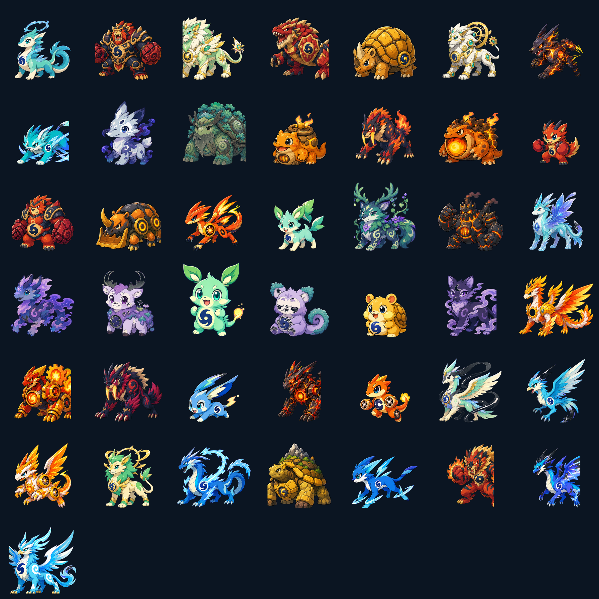
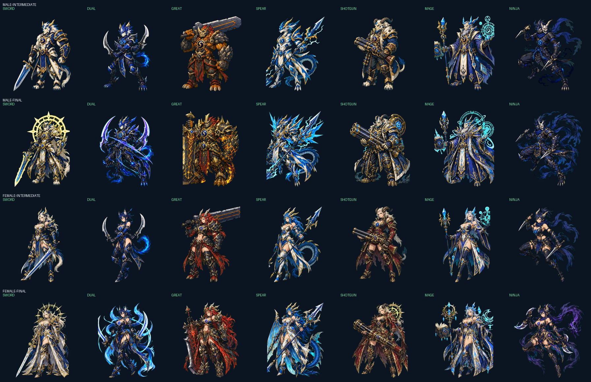

# VitaMorph（仮）

食事と運動の記録から、28日間でモンスターが進化するAndroid育成ゲームです。

## 現在の機能

### 育成と進化

- 28日を1シーズンとして7日ごとに進化
- 全71体の進化表(共通7体・動物系36体・人型28体)。孵化時に性別とルート適性(人型/動物)を抽選し、生活・機嫌・絆で分岐(詳細は [`docs/EVOLUTION_TABLE.md`](docs/EVOLUTION_TABLE.md))
- 孵化時に決まる5性格(がんばりや/のんびり/クール/あまえんぼう/きまぐれ)。会話トーンと連続タッチ許容回数のみに影響し、能力差は付けない
- 孵化時に決まるオス・メス(能力差なし、同じ世代で不変)
- 全71体の図鑑。出会った姿を発見済みとして永続化し、未発見はシルエット表示
- 出会った姿を集める図鑑と、歴代の性別・最終形態・大会順位・継承内容を残す系譜画面

### 交流とバトル

- タッチ(部位判定・クールダウン・連続タッチで嫌がる)、端末内テンプレート会話、10種の変形モーション
- ミニゲーム3種(コアキャッチ、パルストレーニング、ミールバランス)。報酬は1日3回まで
- 機嫌と絆による最大±5%のバトル補正、絆が高いと大会中1回の「トレーナーの応援」
- 技とアイテムを選んで戦うCPUターン制トーナメント。進行中の試合はアプリを終了しても途中から再開できる
- シーズン完了時の能力継承(1世代最大3ポイント、1能力15%上限、減らない)
- 13シーズン（364日）と1,100XPでマスターになる年間ランク

### 食事管理

- 朝・昼・夕・間食の記録。代表食品カタログ(約60品目)、手入力、自作食品、お気に入り、最近の記録、前日コピー
- 材料付きで保存・記録できるレシピ
- 日次サマリー(目標との差、PFCバー)と週間グラフ
- Open Food Factsの食品検索とバーコードスキャン(ML Kitオンデバイス処理)
- 代表的なビタミン・ミネラル(ビタミンC・カルシウム・鉄)の記録・表示

### 連携と保存

- Android Health Connectから歩数、活動カロリー、運動時間、栄養を読み取り
- VitaMorphで記録した栄養をNutritionRecordとしてHealth Connectへ書き込み(Client Record IDで二重計上を回避)
- あすけんのカロリー・PFC目標を初回設定。栄養データの優先元(VitaMorph優先/あすけん優先/日ごとに選択)を選べる
- トレーナー名の設定と変更
- SharedPreferencesとRoomによる端末内保存(世代・機嫌・絆・継承ポイント・食事記録など)
- 実データなしで全サイクルを確認できるデモモード

## プライバシー

- 健康・栄養データは端末内で進化判定と表示に使い、外部サーバーへ送信しません。
- 外部通信はOpen Food Facts(食品検索・バーコード照会)のみで、送信するのは検索キーワードまたはバーコード番号だけです。健康データは送信しません。
- バーコードのカメラ画像はML Kitのオンデバイス処理で解析し、端末外へ出ません。
- 本アプリは医療診断・治療を目的とするものではありません。

## 動作確認(デモモード)

実データがなくても進化サイクルを確認できます。

1. オンボーディング画面で「デモモードで開始」を選びます。
2. 設定タブの「デモを7日進める」を押すごとに1週間分だけ時間が進みます。
3. 4回押すと28日(4週間)の1シーズンが完了し、モルフィ→成長体→成熟体→最終形態の進化と、その世代の性格・性別・ルートを確認できます。
4. シーズン完了後は継承ポイントの付与と系譜への記録、図鑑への発見登録も確認できます。

## キャラクターデザイン



7職業 x 男女 x 成熟体・最終形態の人型28体を進化ルートへ組み込み済みです。



全形態は「紺色の生命コア」を共通モチーフにし、調和・筋力・俊足・蓄積・静養・過活動の6系統で色、体格、エネルギー表現を変えています。詳細なデザインルールと画像生成仕様は [`art/README.md`](art/README.md) に記載しています。共通の幼生・成長体は性別で姿を分けず、共通画像に♂/♀マークを重ねて表示します。

アニメーションは呼吸、生命オーラ、踏み込み、反動、被弾の揺れ、勝利ジャンプに加え、タッチ・会話・ミニゲーム用の反応を組み合わせています。すべてCompose上の変形アニメーションで動作するため、追加の動画ファイルは必要ありません。

## 開発引き継ぎ

- Claude Code向け指示: [`CLAUDE.md`](CLAUDE.md)
- 現在の実装状況: [`docs/HANDOFF_STATUS.md`](docs/HANDOFF_STATUS.md)
- 完成(v1.0)までの作業計画: [`docs/COMPLETION_PLAN.md`](docs/COMPLETION_PLAN.md)
- 実装計画(Phase 1〜6の履歴): [`docs/IMPLEMENTATION_PLAN.md`](docs/IMPLEMENTATION_PLAN.md)
- データモデル: [`docs/DATA_MODEL.md`](docs/DATA_MODEL.md)
- 71体構成ロスター: [`docs/MONSTER_ROSTER.md`](docs/MONSTER_ROSTER.md)
- 71体進化表: [`docs/EVOLUTION_TABLE.md`](docs/EVOLUTION_TABLE.md)
- 画像・アニメーション連携契約: [`docs/MONSTER_ASSET_CONTRACT.md`](docs/MONSTER_ASSET_CONTRACT.md)

## データ連携

想定する連携経路は次のとおりです。

```text
あすけん ──────────────┐
                       ├→ Health Connect → VitaMorph
Amazfit T-Rex 3 → Zepp → Google Fit ┘
```

ZeppからGoogle Fit、Google FitからHealth Connectへの同期設定は端末側で行います。Zeppのバージョンや端末によって同期される項目が異なる可能性があります。

## 開発環境

- JDK 17以上
- Android SDK Platform 36
- Android SDK Build Tools 36.0.0
- Gradle 9.4.1
- Android Gradle Plugin 9.2.1

```bash
./gradlew test assembleDebug
```

APKは次に生成されます。

```text
app/build/outputs/apk/debug/app-debug.apk
```

## GitHubからAPKを取得する

`main`へpushするとGitHub ActionsがテストとAPKビルドを行います。Actionsの実行結果にある `vitalmorph-debug-apk` からインストール用APKを取得できます。

個人利用の初期確認ではdebug APKを使えます。ただしGitHub Actionsが毎回作るdebug署名は更新時に変わる可能性があるため、継続利用には署名済みrelease APKを使ってください。

### 継続更新用の署名設定

署名鍵は一度だけ作成し、安全な場所にバックアップします。鍵を失うと、インストール済みアプリを同じアプリとして更新できません。

```bash
keytool -genkeypair -v -keystore vitalmorph-release.jks \
  -alias vitalmorph -keyalg RSA -keysize 4096 -validity 10000
```

GitHubリポジトリの `Settings > Secrets and variables > Actions` に次の4件を登録します。

- `VITALMORPH_KEYSTORE_BASE64`: `base64 < vitalmorph-release.jks | tr -d '\n'` の結果
- `VITALMORPH_STORE_PASSWORD`: キーストアのパスワード
- `VITALMORPH_KEY_ALIAS`: `vitalmorph`
- `VITALMORPH_KEY_PASSWORD`: 鍵のパスワード

その後、タグをpushするとGitHub Releasesへ署名済みAPKが公開されます。

```bash
git tag v0.3.1
git push origin v0.3.1
```

署名鍵やパスワードをGitHubへ直接コミットしないでください。

## 注意

- 公開前にアプリ名、パッケージ名、アイコン、プライバシーポリシーURLを確定してください。
- Google Playへ公開する場合は、Health apps declarationとHealth Connectのデータ型申請が必要です。
- 現時点ではバックグラウンド同期を行わず、アプリを開いたときに同期します。
